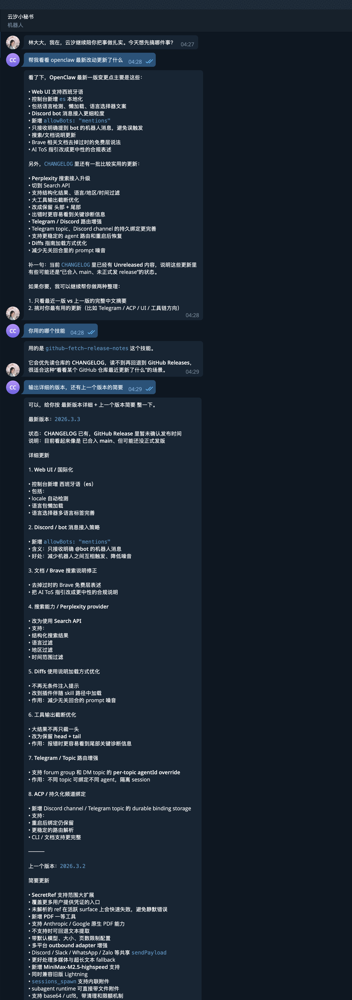
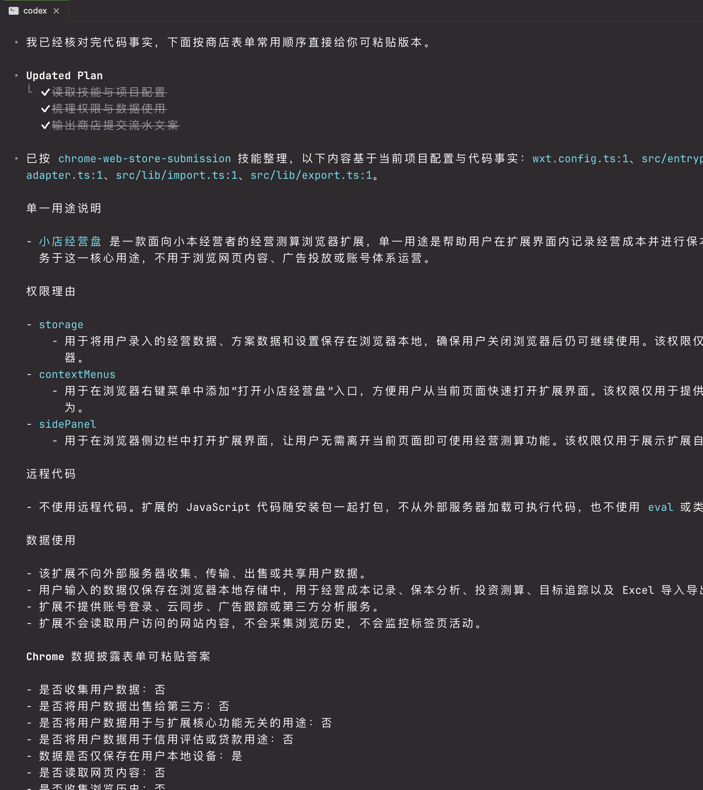

# agent-skills

English | [简体中文](./README.zh.md)

A curated collection of practical agent skills maintained by [@crper](https://github.com/crper).

Each skill lives under `skills/<skill-name>/` and includes its own `SKILL.md`, docs, references, scripts, and evals when needed.

## Install

Install a specific skill from this repository:

```bash
npx skills add https://github.com/crper/agent-skills --skill github-fetch-release-notes
npx skills add https://github.com/crper/agent-skills --skill chrome-web-store-submission
```

List installable skills:

```bash
npx skills add https://github.com/crper/agent-skills --list
```

## Skill Index

| Category | Skill | What it does | Preview |
| --- | --- | --- | --- |
| Repository Intelligence | [`github-fetch-release-notes`](./skills/github-fetch-release-notes/README.md) | Fetches GitHub Release / CHANGELOG updates through local `gh` auth and returns stable JSON. |  |
| Store & Publishing | [`chrome-web-store-submission`](./skills/chrome-web-store-submission/README.md) | Prepares copy-and-paste Chrome Web Store submission copy, including permissions, privacy answers, and reviewer notes. |  |

## Contributing

See [`CONTRIBUTING.md`](./CONTRIBUTING.md) for repository conventions and skill structure guidelines.

## License

See [`LICENSE`](./LICENSE).
