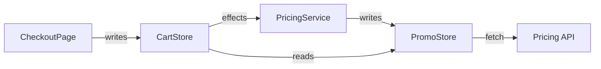
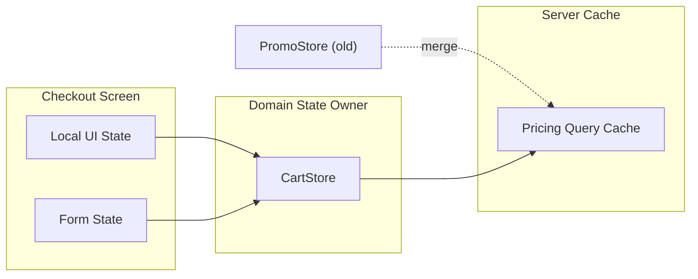
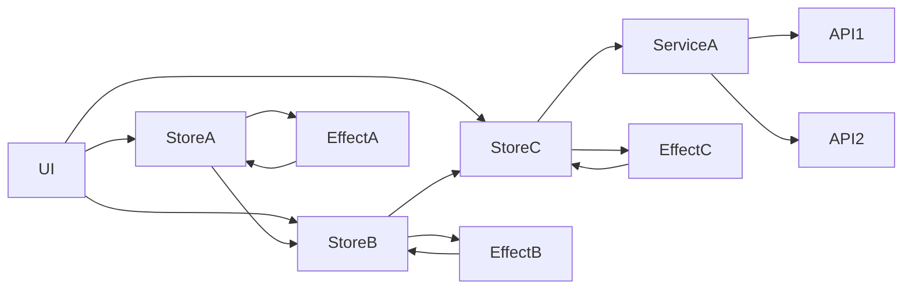

# Examples Reference

Use this reference when you want a concrete model for what "good" looks like.

## Contents

- ASCII pre-map good and bad examples
- Mermaid good and bad examples
- Subagent Gate examples

## ASCII Pre-Map Examples

### Good: simple and terminal-safe

```text
[CheckoutPage]
  -> [Local UI State]
  -> [Form State]
  -> [CartStore] -> [PricingService] -> [API]
  -> [Query Cache] ------------------> [API]
```

Why this works:

- stays readable in plain terminals
- shows ownership split quickly
- keeps the highest-value path visible

### Good: duplication problem made explicit

```text
[ProductPage] -> [ProductStore] -> [Effect] -> [SearchStore]
       \------------------------------------>/
```

Why this works:

- the duplicated truth or cycle is obvious
- only the problematic path is shown

### Bad: too wide and too dense

```text
[CheckoutPageStateAndDerivedPromotionsResolver] -> [CartPricingAndCouponMutationCoordinator] -> [DiscountNormalizationAndConflictResolutionService]
```

Why this fails:

- too wide for many terminals
- labels are too long to scan
- no ownership or branching cues

### Bad: decorative but fragile

```text
╔══════════╗   ╔══════════════╗   ╔════════╗
║   UI     ║──▶║ Fancy Store  ║──▶║ API    ║
╚══════════╝   ╚══════════════╝   ╚════════╝
```

Why this fails:

- box drawing may break alignment in some terminals or agents
- visual polish adds little architectural meaning

## Mermaid Examples

### Good: current problematic path



Why this works:

- one path, one problem
- edge labels add meaning
- real modules remain visible

### Good: target ownership map



Why this works:

- ownership boundaries are explicit
- old-to-new mapping is visible
- it is structural, not a second runtime flow

### Bad: tries to show the whole app



Why this fails:

- too many nodes, too little prioritization
- the main problem disappears inside noise
- not friendly for users or agents

## Subagent Gate Examples

### Open subagents

Scenario:

- 4 prioritized state subjects
- ownership split across `src/pages/checkout/`, `src/stores/`, and `src/query/`
- one question is about ownership, another is about write fan-out

Good decision:

- main agent performs inventory and triage
- launch ownership, mutation-path, and smell-and-target agents in parallel

Why:

- questions are separable
- file-reading work is not identical
- results can be merged and verified

### Stay local

Scenario:

- only 2 prioritized subjects
- both live in the same `src/stores/cart.ts`
- the real issue is hidden temporal coupling inside one reducer chain

Good decision:

- stay single-threaded
- trace reads and writes locally

Why:

- parallel agents would reread the same file
- the problem needs integrated reasoning more than parallel coverage

### Downgrade parallel ambition

Scenario:

- user wants a quick pass
- repo is medium-sized
- evidence is partial and several imports are generated

Good decision:

- skip subagents
- keep the report narrow
- mark missing areas as `待确认`

Why:

- coordination cost is not worth it
- parallel review would produce more speculation than signal
